# GKMPS School ERP — Architecture Diagrams

HLD · LLD · per-module ER · one ASP.NET Core 9 app in 4 tiers (Api → Business → DataAccess, + Common) · TiDB · Caddy

> Diagrams are Mermaid source, rendered natively by GitHub — no external tools needed to view them.

## Contents

**HLD**
- [1. System architecture](#1-system-architecture)
- [2. Events and cross-module calls](#2-events-and-cross-module-calls)

**LLD**
- [3. N-tier layering](#3-n-tier-layering)
- [4. Auth: login, lockout, refresh rotation](#4-auth-login-lockout-refresh-rotation-self-service-scoping)
- [5. The atomic-update pattern](#5-the-atomic-update-pattern-used-in-4-modules)

**ER** — [Identity](#identity-module--er) · [Student](#student-module--er) · [Staff](#staff-module--er) · [Attendance](#attendance-module--er) · [Academic](#academic-module--er) · [Examination](#examination-module--er) · [Fee](#fee-module--er) · [Communication](#communication-module--er) · [Library](#library-module--er) · [Transport](#transport-module--er) · [Notification](#notification-module--er) · [Reporting](#reporting-module--er)

---

## 1. System architecture

A single deployable ASP.NET Core app (`SchoolERP.Api`) behind Caddy. It is organised into tiers, and within each tier into the 12 school modules (Identity, Student, Staff, Attendance, Academic, Examination, Fee, Communication, Library, Transport, Notification, Reporting). Each module keeps its **own database** on one TiDB (MySQL-protocol) server. Receipts, report cards and transfer certificates are PDFs kept in their own `files` database, handed out as short-lived signed links that the API serves itself (Azure Blob Storage with SAS links remains an opt-in alternative).

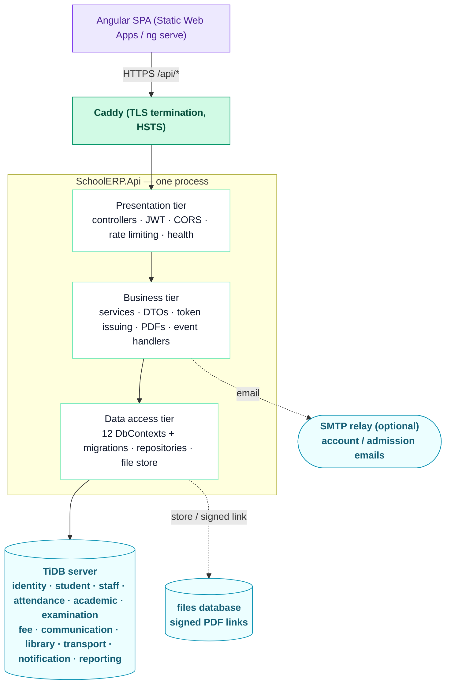

Why one app: the school has ~1,300 accounts and a few hundred daily users. The earlier 12-service design needed ~1.5 GB of RAM across 17 containers (services, gateway, RabbitMQ, Redis); this app uses ~200 MB, starts in seconds, and fits free or near-free hosting — while keeping the same module boundaries, databases and API routes.

## 2. Events and cross-module calls

Modules call each other's **business services** directly (in-process), never another module's tables. Side effects that shouldn't slow a request down go through an in-process event bus.

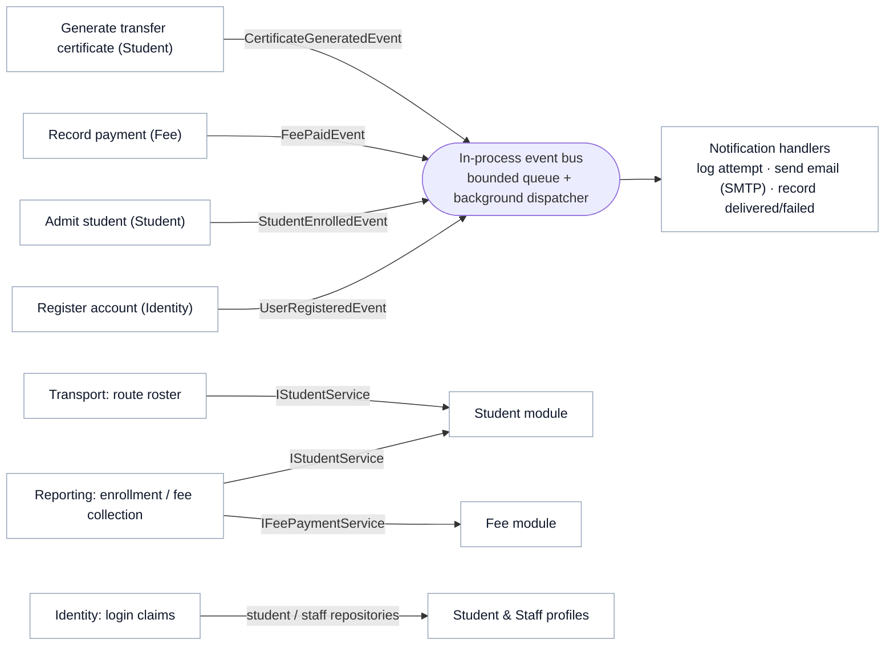

Events are raised **after** the change is saved, and handlers run on a background worker in their own DI scope, so a slow email never delays the request. Queued events live in memory: one raised in the instant before the process stops is lost, which is acceptable because events only drive notifications (every attempt is also recorded in `NotificationLogs`). `CertificateGeneratedEvent` carries a verification code, never a download link.

## 3. N-tier layering

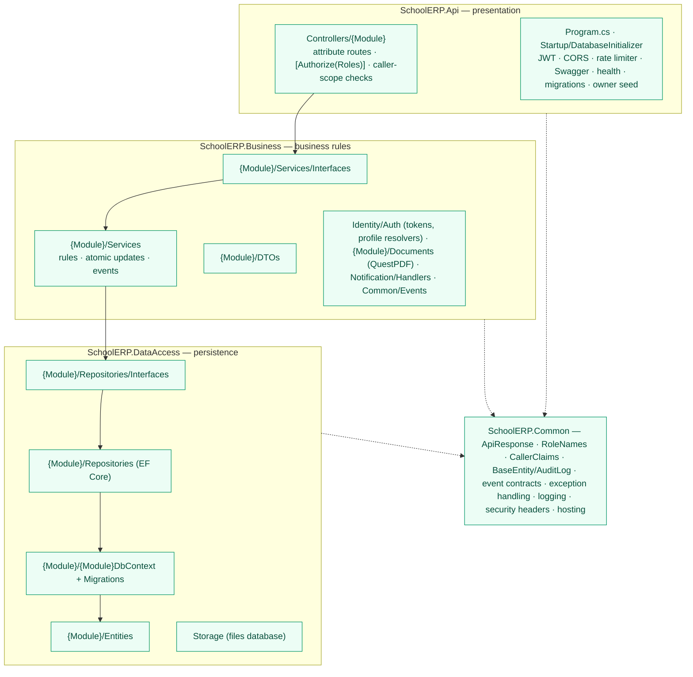

Project references enforce the direction: **Api → Business → DataAccess → Common**. Controllers never touch repositories or DbContexts, and repositories never see DTOs or services.

`BaseEntity.IsDeleted` gives every entity soft delete — global query filters exclude it by default. Admin actions write structured `AUDIT` log lines (who/what/before/after) via Serilog.

## 4. Auth: login, lockout, refresh rotation, self-service scoping

JWT (15 min) + rotating hashed refresh tokens (7 days), PBKDF2 password hashing, account lockout, and role-based scope claims embedded at issue time.

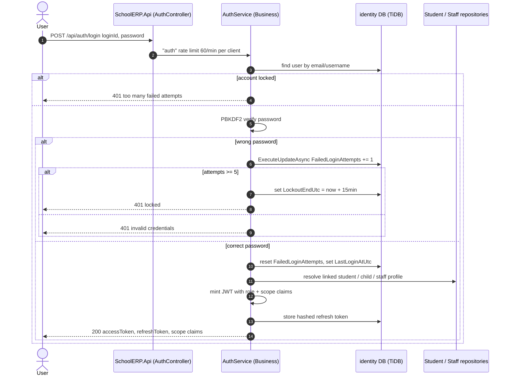

On refresh, presenting an already-revoked token revokes the whole token family for that user (theft-reuse detection) — see `AuthService.RefreshAsync`.

## 5. The atomic-update pattern (used in 4 modules)

Fee.PaidAmount, Attendance's monthly counters, Library.AvailableCopies, and Identity's FailedLoginAttempts are all updated the same way: a single `ExecuteUpdateAsync` SQL statement, never a load-then-save.

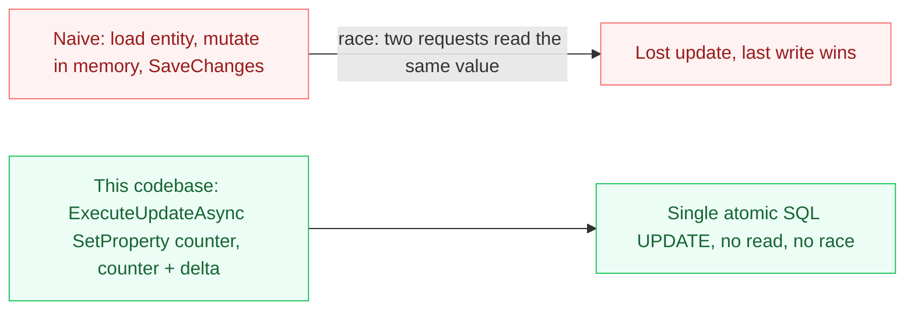

Trade-off: because it bypasses the change tracker, a previously-loaded in-memory copy goes stale immediately — code that needs the fresh value re-reads it (see the comment in `AuthService.LoginAsync`).

---

## Identity module — ER

Single accounts table for all 8 roles; refresh tokens are stored hashed, never raw.

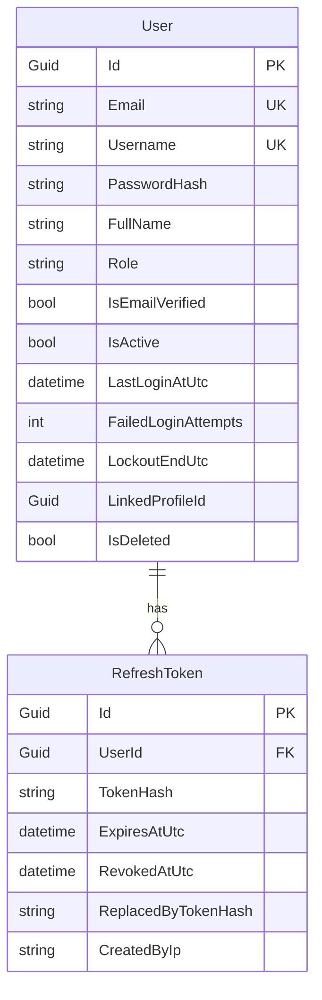

## Student module — ER

Admission record, uploaded/generated documents, and the transfer-certificate two-step workflow with a public verification code.

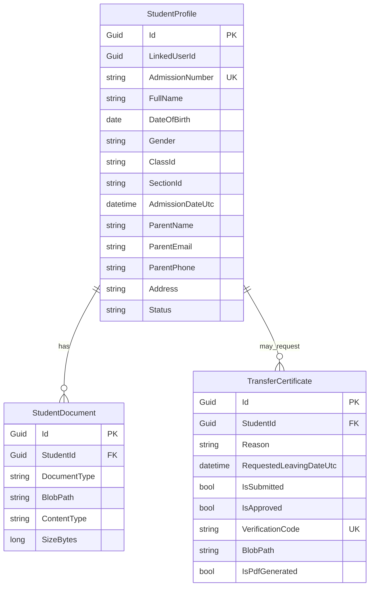

## Staff module — ER

Staff profiles with class-teacher assignment, an immutable payout ledger, daily attendance, and a two-step leave workflow.

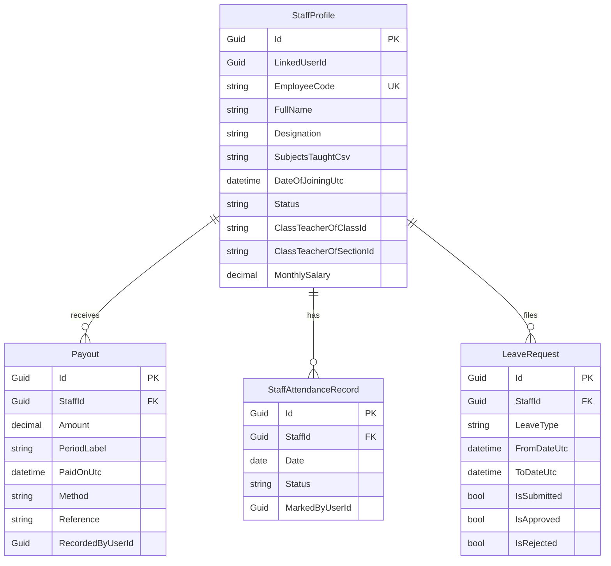

## Attendance module — ER

Daily records plus a monthly rollup that's bumped atomically.

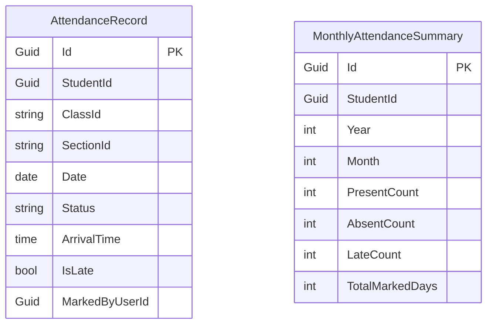

Unique index on (StudentId, Date) backs the duplicate-prevention check `HasMarkedAttendanceTodayAsync`.

## Academic module — ER

Subjects are relational; timetable slots and the timetable-generator config are stored as JSON blobs, cached in memory on read.

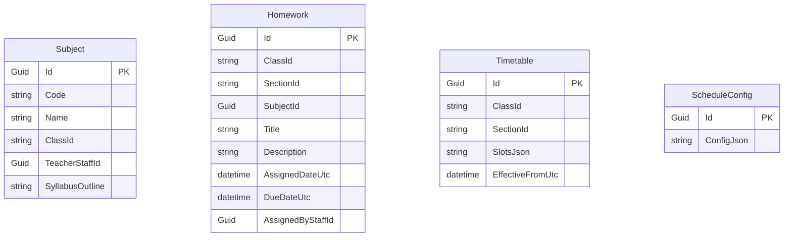

`SlotsJson` holds `[{day,period,subjectId,teacherStaffId,startTime,endTime}]`. Slot count/shape per class varies and is never queried column-by-column — deserialize-and-validate in the service layer beats a rigid one-row-per-slot schema.

## Examination module — ER

Exams (with a JSON answer key) and one marks row per student per exam, duplicate-guarded.

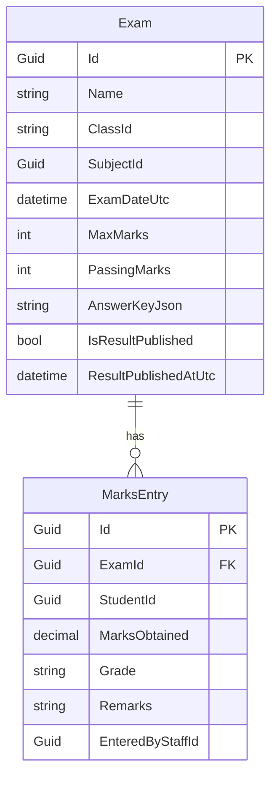

Unique (ExamId, StudentId) index backs `HasMarksEnteredAsync`; corrections go through a separate atomic update path.

## Fee module — ER

The richest schema: class fee structures, per-student dues with a computed Status, an immutable transaction ledger, and a two-step waiver approval.

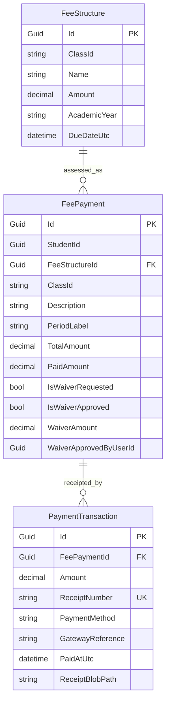

`FeeStructureId` is nullable — null for ad-hoc dues. `FeePayment.Status` is a computed C# property (`PaidAmount + WaiverAmount >= TotalAmount ? Paid : ...`), not a stored column.

## Communication module — ER

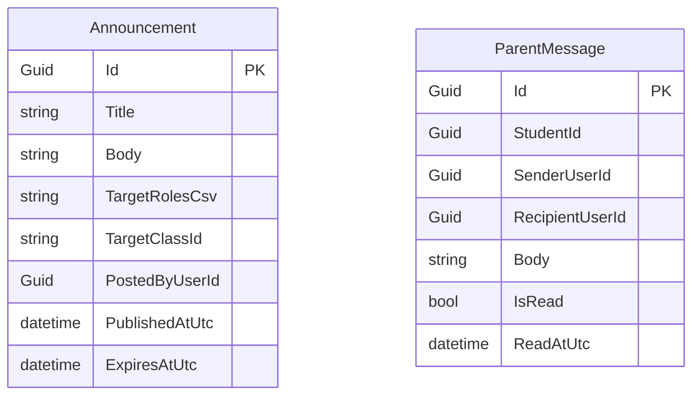

## Library module — ER

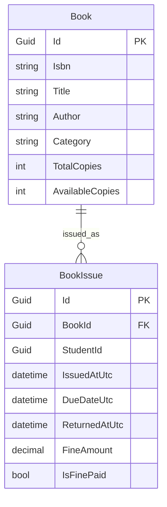

`AvailableCopies` is decremented/incremented via `ExecuteUpdateAsync` on issue/return — the same atomic pattern as Fee and Attendance.

## Transport module — ER

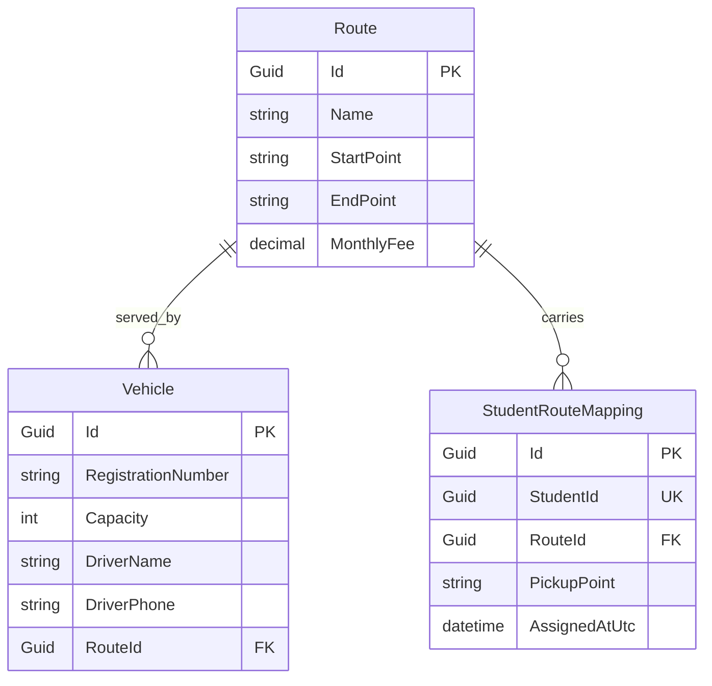

Unique index on StudentId in the mapping — a student can only be on one route at a time.

## Notification module — ER

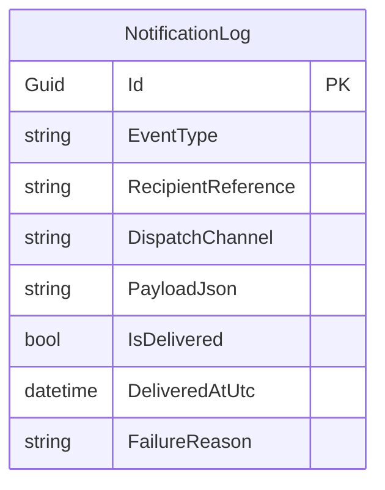

One durable row per consumed event across all 4 MassTransit consumers — UserRegisteredConsumer, StudentEnrolledConsumer, FeePaidConsumer, CertificateGeneratedConsumer.

## Reporting module — ER

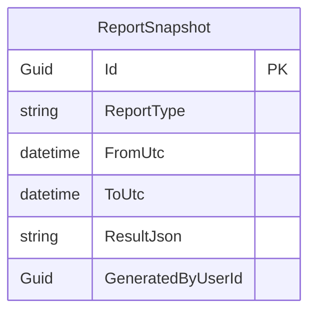

Reporting owns only its own generated-report history; the underlying figures are always fetched fresh through the Student and Fee business services, never by querying their tables.
