# GKMPS School ERP — Architecture Diagrams

HLD · LLD · per-service ER · 12 ASP.NET Core 9 microservices · YARP gateway `:5100` · TiDB · Redis · RabbitMQ/MassTransit + Outbox

> Diagrams are Mermaid source, rendered natively by GitHub — no external tools needed to view them.

## Contents

**HLD**
- [1. System architecture](#1-system-architecture)
- [2. Event flow & Reporting's synchronous fan-out](#2-event-flow--reportings-synchronous-fan-out)

**LLD**
- [3. Per-service layering (5-tier)](#3-per-service-layering-5-tier)
- [4. Auth: login, lockout, refresh rotation](#4-auth-login-lockout-refresh-rotation-self-service-scoping)
- [5. The atomic-update pattern](#5-the-atomic-update-pattern-repeated-across-4-services)

**ER** — [Identity](#identityapi--er) · [Student](#studentapi--er) · [Staff](#staffapi--er) · [Attendance](#attendanceapi--er) · [Academic](#academicapi--er) · [Examination](#examinationapi--er) · [Fee](#feeapi--er) · [Communication](#communicationapi--er) · [Library](#libraryapi--er) · [Transport](#transportapi--er) · [Notification](#notificationapi--er) · [Reporting](#reportingapi--er)

---

## 1. System architecture

12 services behind a YARP gateway (`:5100`), each with its own TiDB (MySQL-wire-protocol) database. Redis backs distributed caching and a fast refresh-token revocation check. RabbitMQ + MassTransit carries 4 integration events, with a transactional **Outbox** on Identity/Student/Fee.

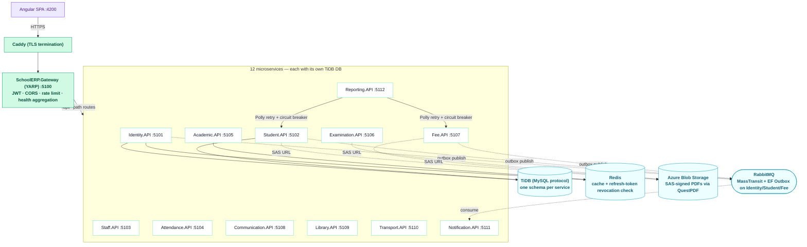

Only Identity, Student and Fee publish events — via the outbox pattern (event row written in the same DB transaction as the business change, then relayed to RabbitMQ), so a crash between commit and publish can't lose the event.

## 2. Event flow & Reporting's synchronous fan-out

Two communication styles side by side: async fan-out (Notification consumes all 4 events) and sync composition with resilience (Reporting calls Student/Fee directly over HTTP, wrapped in Polly).

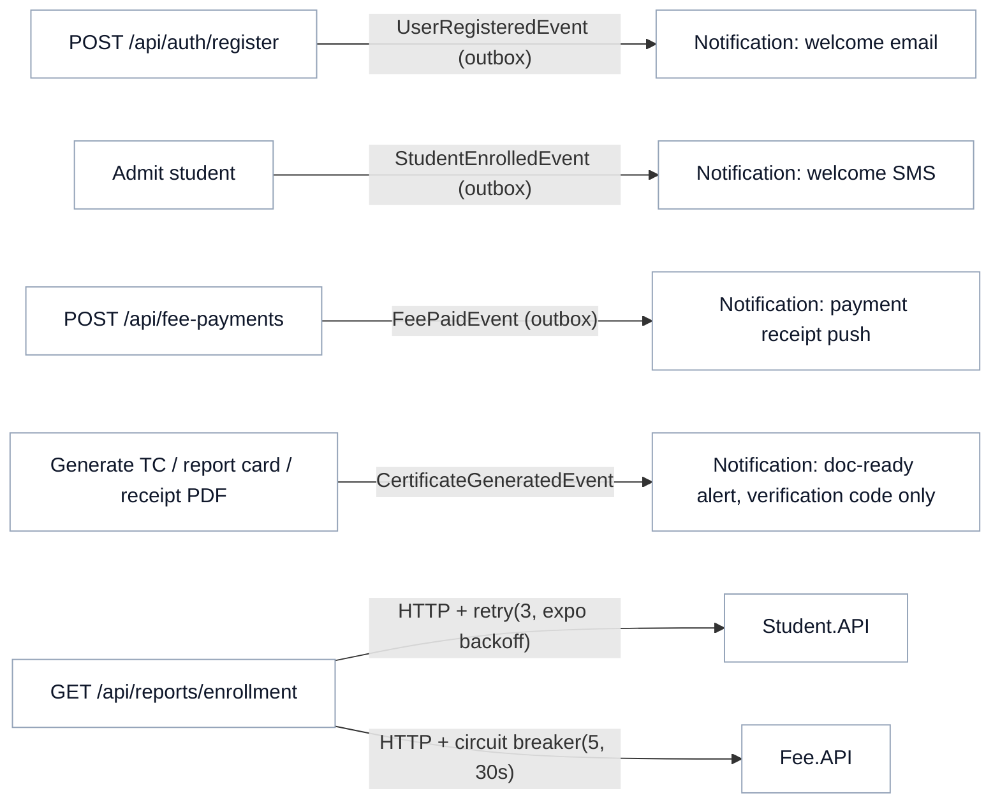

`CertificateGeneratedEvent` carries a `VerificationCode`, not the SAS URL — the message bus/consumer logs can never leak a working, time-limited link to a certificate.

## 3. Per-service layering (5-tier)

Every one of the 12 services follows exactly the same shape, stated in the README: Entity → Repository Interface → Service Interface → Service Implementation → Controller.

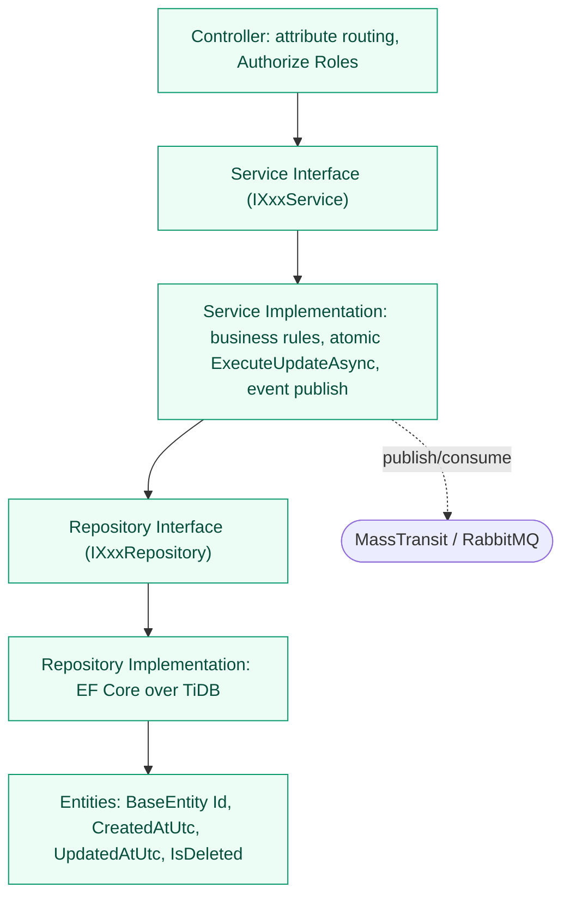

`BaseEntity.IsDeleted` gives every entity soft delete — global query filters exclude it by default. Every service also has an `AuditLog` table (who/what/before/after), fed to Serilog and persisted for queryable history.

## 4. Auth: login, lockout, refresh rotation, self-service scoping

JWT (15 min) + rotating hashed refresh tokens (7 days), PBKDF2 password hashing, account lockout, and role-based scope claims embedded at issue time.

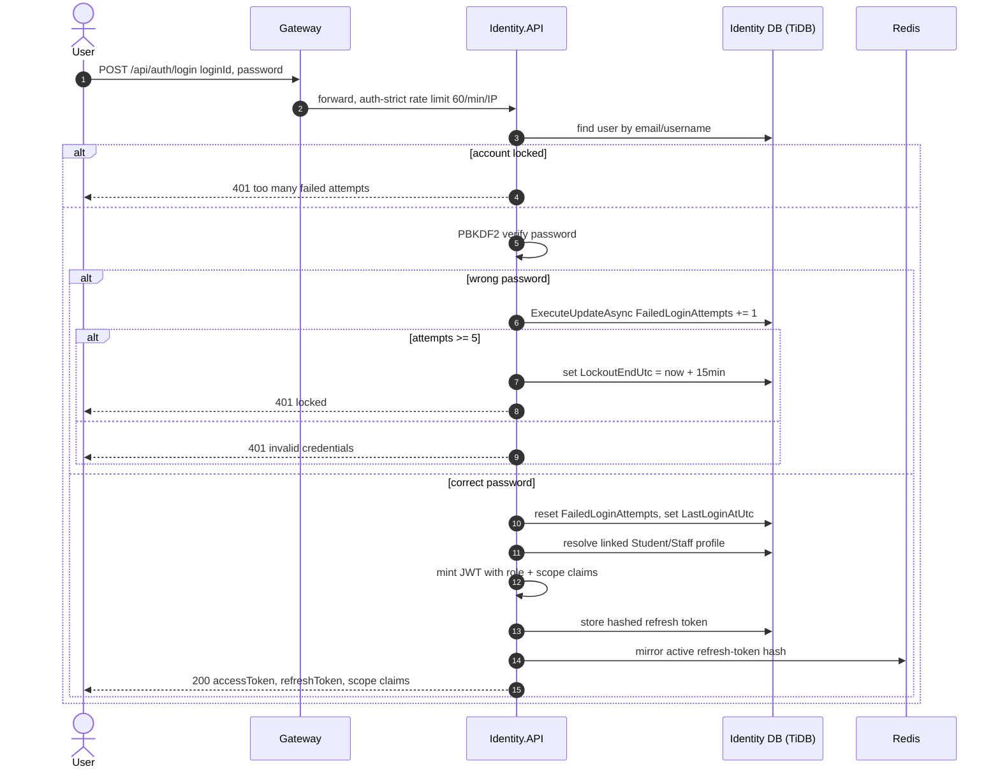

On refresh, presenting an already-revoked token revokes the whole token family for that user (theft-reuse detection) — see `AuthService.RefreshAsync`.

## 5. The atomic-update pattern (repeated across 4 services)

Fee.PaidAmount, Attendance's monthly counters, Library.AvailableCopies, and Identity's FailedLoginAttempts are all updated the same way: a single `ExecuteUpdateAsync` SQL statement, never a load-then-save.

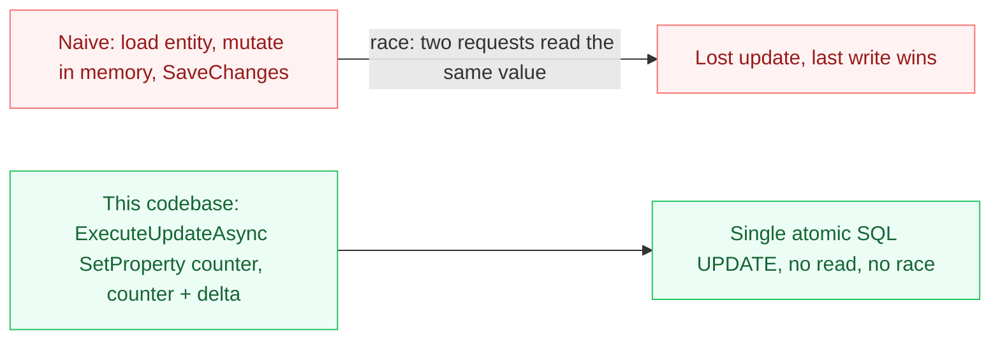

Trade-off: because it bypasses the change tracker, a previously-loaded in-memory copy goes stale immediately — code that needs the fresh value re-reads it (see the comment in `AuthService.LoginAsync`).

---

## Identity.API — ER

Single accounts table for all 8 roles; refresh tokens are stored hashed, never raw.

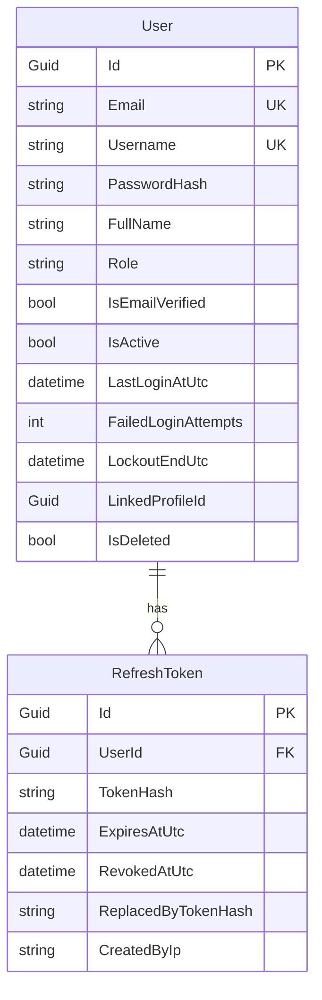

## Student.API — ER

Admission record, uploaded/generated documents, and the transfer-certificate two-step workflow with a public verification code.

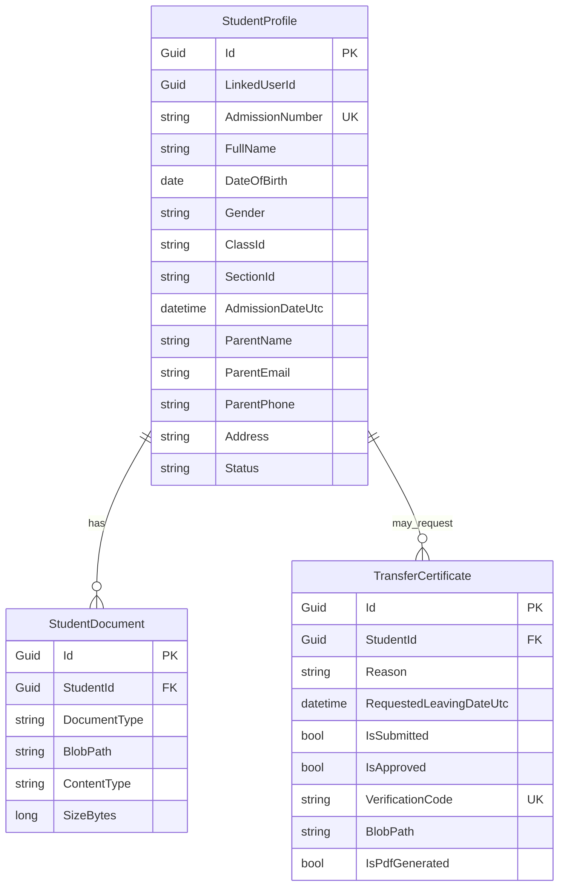

## Staff.API — ER

Staff profiles with class-teacher assignment, an immutable payout ledger, daily attendance, and a two-step leave workflow.

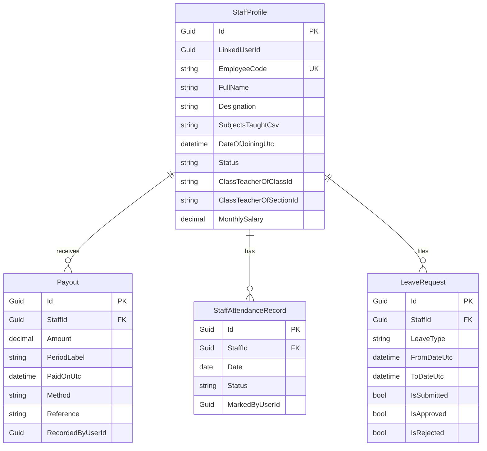

## Attendance.API — ER

Daily records plus a monthly rollup that's bumped atomically.

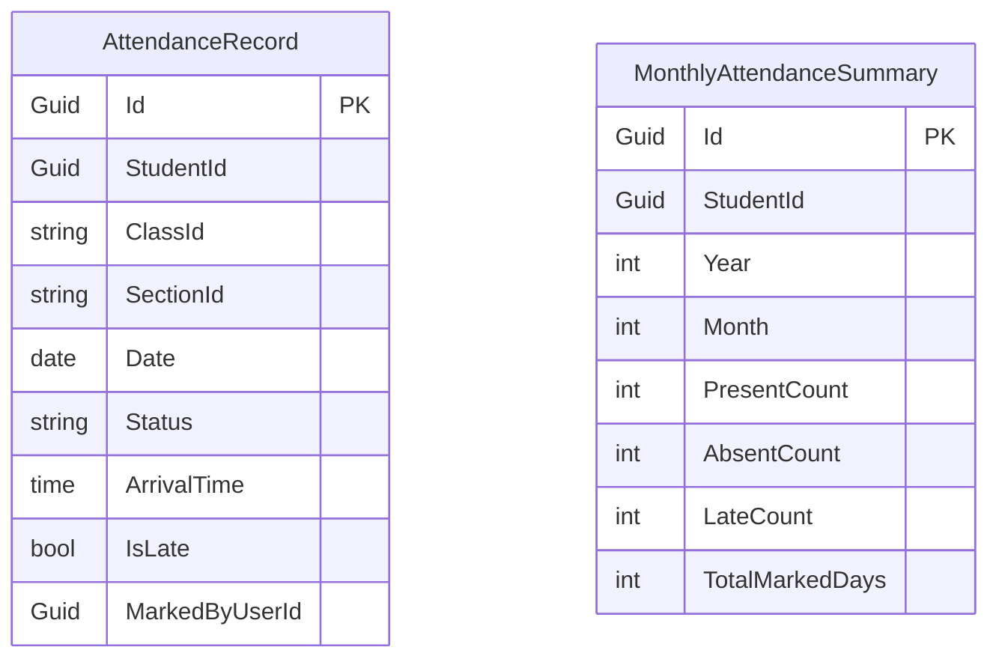

Unique index on (StudentId, Date) backs the duplicate-prevention check `HasMarkedAttendanceTodayAsync`.

## Academic.API — ER

Subjects are relational; timetable slots and the timetable-generator config are stored as JSON blobs, Redis-cached on read.

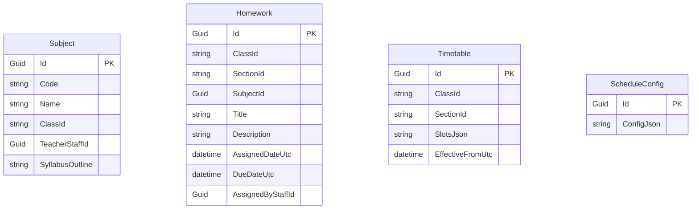

`SlotsJson` holds `[{day,period,subjectId,teacherStaffId,startTime,endTime}]`. Slot count/shape per class varies and is never queried column-by-column — deserialize-and-validate in the service layer beats a rigid one-row-per-slot schema.

## Examination.API — ER

Exams (with a JSON answer key) and one marks row per student per exam, duplicate-guarded.

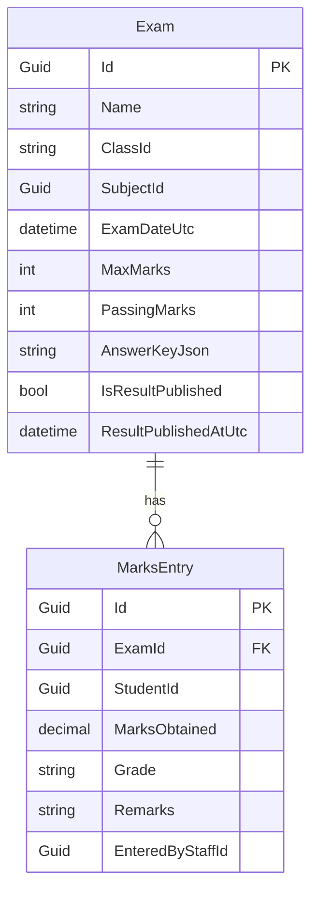

Unique (ExamId, StudentId) index backs `HasMarksEnteredAsync`; corrections go through a separate atomic update path.

## Fee.API — ER

The richest schema: class fee structures, per-student dues with a computed Status, an immutable transaction ledger, and a two-step waiver approval.

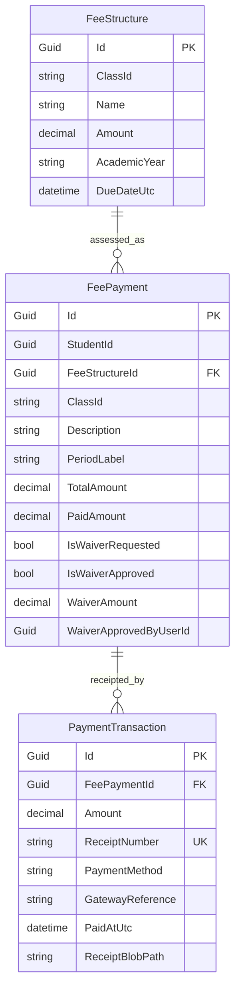

`FeeStructureId` is nullable — null for ad-hoc dues. `FeePayment.Status` is a computed C# property (`PaidAmount + WaiverAmount >= TotalAmount ? Paid : ...`), not a stored column.

## Communication.API — ER

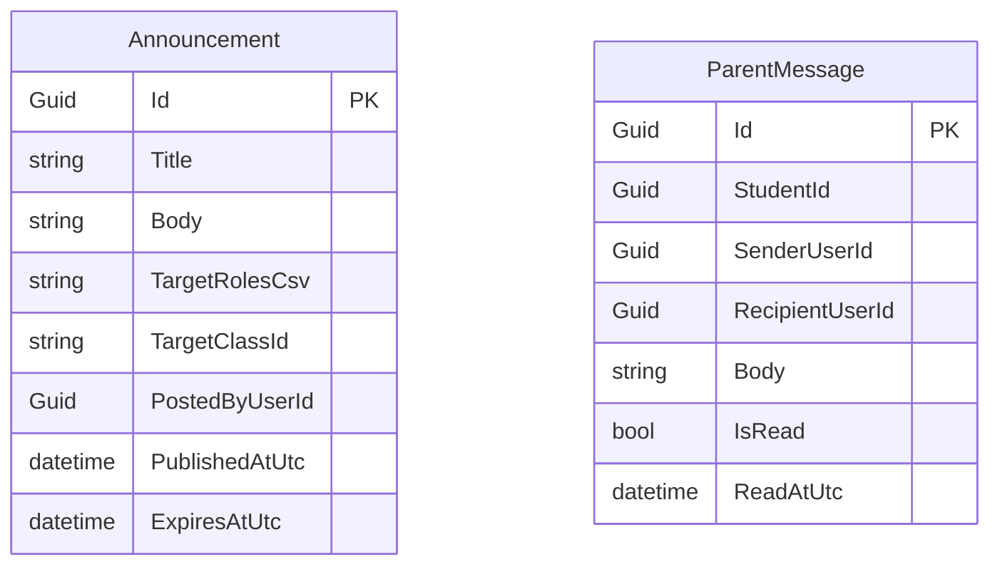

## Library.API — ER

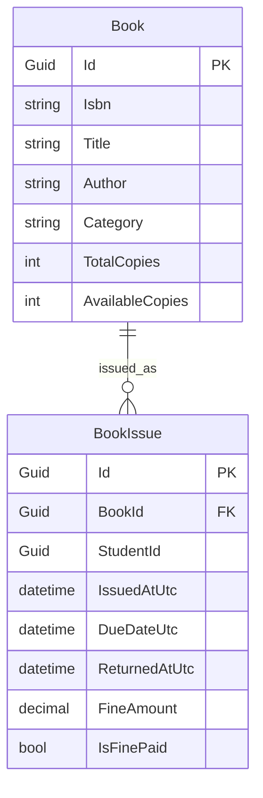

`AvailableCopies` is decremented/incremented via `ExecuteUpdateAsync` on issue/return — the same atomic pattern as Fee and Attendance.

## Transport.API — ER

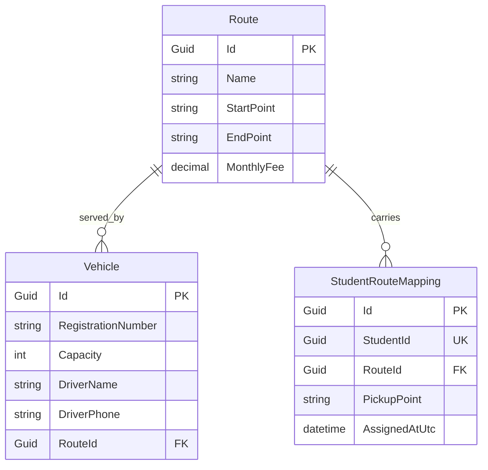

Unique index on StudentId in the mapping — a student can only be on one route at a time.

## Notification.API — ER

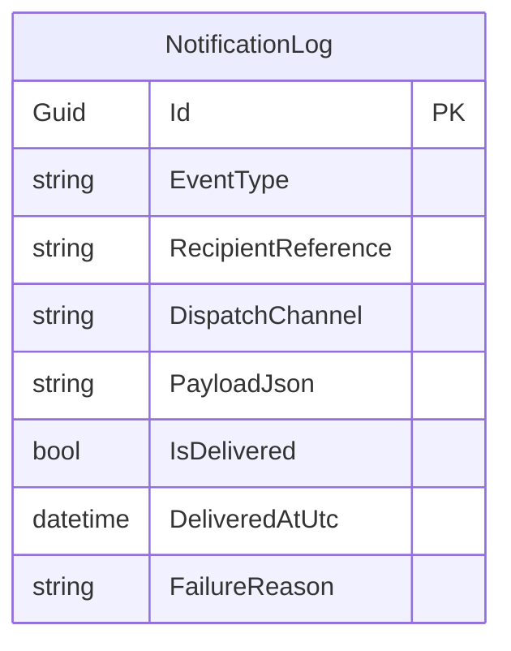

One durable row per consumed event across all 4 MassTransit consumers — UserRegisteredConsumer, StudentEnrolledConsumer, FeePaidConsumer, CertificateGeneratedConsumer.

## Reporting.API — ER

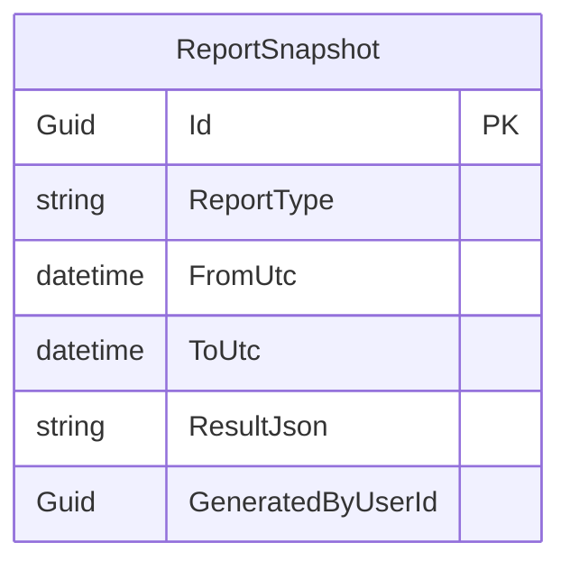

Reporting owns only its own generated-report history; the underlying figures are always fetched fresh from Student.API/Fee.API via Polly-wrapped HttpClients, never joined cross-schema.
