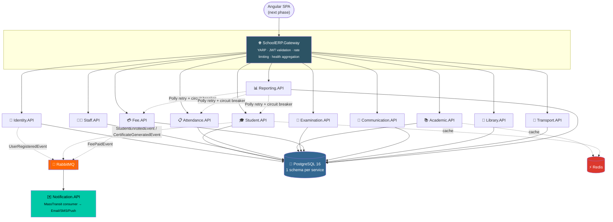

<div align="center">


<a href="https://github.com/ojas2005/GKMPS-School-portal/actions/workflows/backend-ci.yml">
  
</a>


<br/>

<a href="#-running-locally">
  
</a>

</div>

<br/>

A **backend-only** ASP.NET Core 9 microservices system for running a school end to end —
admissions, attendance, academics, exams, fees, library, transport, communication, and
reporting — built for a single owner (the school itself) with **data security**,
**reliability**, and **accessibility** as the non-negotiable design goals. The Angular
frontend is the next phase.

All 12 services follow the same five-layer pattern end to end:

<div align="center">

`Entity` → `Repository Interface` → `Service Interface` → `Service Implementation` → `Controller`

</div>

<br/>

## Contents

- [Architecture](#-architecture)
- [Services at a glance](#-services-at-a-glance)
- [Running locally](#-running-locally)
- [Authentication model](#-authentication-model--owner-issued-accounts-no-self-registration)
- [Testing the APIs](#-testing-the-apis)
- [Migrations](#-migrations)
- [Per-service endpoint summary](#-per-service-endpoint-summary)
- [Security & reliability](#-security--reliability-choices-why-theyre-here)
- [Next steps](#-next-steps)

<br/>

## Architecture



<sub>Full request path: **client → Caddy (TLS) → Gateway (YARP, JWT-checked) → service →
Postgres schema**, with Redis read-through caching and RabbitMQ/MassTransit for
fire-and-forget cross-service events.</sub>

<br/>

```
SchoolERP.sln
BuildingBlocks/
  SchoolERP.Shared/          # BaseEntity, AuditLog, ApiResponse, RoleNames, cross-service event contracts
Services/
  Identity.API/               # Accounts, JWT + refresh rotation, Google OAuth, RBAC
  Student.API/                # Admissions, class/section management, transfer certificates
  Staff.API/                  # Staff profiles, two-step leave approval workflow
  Attendance.API/             # Daily attendance, atomic present/absent/late counters
  Academic.API/                # Subjects, JSON-based timetables, homework
  Examination.API/            # Exams, marks entry, aggregates, QuestPDF report cards
  Fee.API/                    # Fee structures, atomic paid-amount updates, receipts, waivers
  Communication.API/          # Announcements, parent messaging
  Library.API/                # Books, atomic available-copies, issue/return, fines
  Transport.API/              # Routes, vehicles, student-route mapping
  Notification.API/           # MassTransit consumers -> email/SMS/push fan-out
  Reporting.API/               # Cross-service aggregates via Polly-wrapped HTTP clients, PDF export
Gateway/
  SchoolERP.Gateway/          # YARP: routing, JWT validation, rate limiting, health aggregation
scripts/                      # 01-13: hand-authored SQL matching each service's EF model (see "Migrations" below)
docker-compose.yml
.env.example
```

<br/>

## Services at a glance

| | Service | Owns | Publishes |
|---|---|---|---|
| 🔐 | **Identity.API** | Accounts, JWT + rotated refresh tokens, Google OAuth, RBAC | `UserRegisteredEvent` |
| 🎓 | **Student.API** | Admissions, class/section moves, transfer certificates + verification | `StudentEnrolledEvent`, `CertificateGeneratedEvent` |
| 🧑‍🏫 | **Staff.API** | Staff profiles, two-step leave approval | — |
| 📋 | **Attendance.API** | Daily attendance, atomic present/absent/late counters | — |
| 📚 | **Academic.API** | Subjects, JSON timetables (Redis-cached), homework | — |
| 📝 | **Examination.API** | Exams, marks entry, rankings, QuestPDF report cards | — |
| 💳 | **Fee.API** | Fee structures, atomic payments, receipts, waivers | `FeePaidEvent` |
| 📣 | **Communication.API** | Announcements, parent↔teacher messaging | — |
| 📖 | **Library.API** | Books, atomic issue/return, fines | — |
| 🚌 | **Transport.API** | Routes, vehicles, student-route mapping | — |
| ✉️ | **Notification.API** | Fans out every event above via Email/SMS/Push | consumes all of the above |
| 📊 | **Reporting.API** | Cross-service aggregates (Polly retry + circuit breaker), PDF export | — |

<br/>

## 🚀 Running locally

```bash
# 1. Install the .NET 9 SDK and Docker
# 2. Configure environment
cp .env.example .env   # fill in JWT_SIGNING_KEY (32+ chars) + Postgres/RabbitMQ passwords

# 3. Build & run everything: Postgres, Redis, RabbitMQ, all 12 services, and the gateway
docker compose up --build
```

| Endpoint | URL |
|---|---|
| Gateway | http://localhost:5100 |
| RabbitMQ management UI | http://localhost:15672 |

Every service also exposes its own Swagger directly (left on in every environment so you
can test APIs without extra setup):

| Service | Direct port | Swagger |
|---|---|---|
| Identity.API | 5101 | http://localhost:5101/swagger |
| Student.API | 5102 | http://localhost:5102/swagger |
| Staff.API | 5103 | http://localhost:5103/swagger |
| Attendance.API | 5104 | http://localhost:5104/swagger |
| Academic.API | 5105 | http://localhost:5105/swagger |
| Examination.API | 5106 | http://localhost:5106/swagger |
| Fee.API | 5107 | http://localhost:5107/swagger |
| Communication.API | 5108 | http://localhost:5108/swagger |
| Library.API | 5109 | http://localhost:5109/swagger |
| Transport.API | 5110 | http://localhost:5110/swagger |
| Notification.API | 5111 | http://localhost:5111/swagger |
| Reporting.API | 5112 | http://localhost:5112/swagger |

<br/>

## 🔑 Authentication model — owner-issued accounts, no self-registration

There is no public sign-up. `POST /api/auth/register` requires a SuperAdmin/Principal/
Admin bearer token — only the school owner (or someone they've granted admin rights to)
can create accounts. On first startup, Identity.API seeds one bootstrap account:

- **Username**: `ownerishim`
- **Password**: `Owner@1234`
- (override via `Owner:Username` / `Owner:Password` config before first run)

Login accepts either the username or the email in the same `loginId` field:

```json
POST /api/auth/login
{ "loginId": "...", "password": "..." }
```

The owner creates every student/teacher account (choosing their login ID and password)
and hands the credentials over directly — there's no forgot-password flow yet.

<br/>

## 🧪 Testing the APIs

The fastest path: open any service's Swagger URL above, log in as the owner via
`POST /api/auth/login` on Identity.API, copy the `accessToken` from the response, click
**Authorize** in Swagger, paste `Bearer <token>`, and call any endpoint — including
`POST /api/auth/register` to create further accounts. All Swagger UIs are reachable
directly on their service port; the gateway also proxies each one at `/{service}/swagger`
(e.g. `http://localhost:5100/student/swagger`) once behind the gateway.

Public endpoints that don't need a token: `POST /api/auth/login`, `POST
/api/auth/login/google`, `POST /api/auth/refresh`, and `GET
/api/transfer-certificates/verify/{code}`.

<br/>

## 🗃 Migrations

Every service has a real `Migrations/` (or `Data/Migrations/`) folder containing an
`InitialCreate` migration, and every `Program.cs` calls `db.Database.Migrate()` on
startup, so `docker compose up` creates each service's schema automatically. Provenance
differs by service:

- **Identity.API and Student.API** carry migrations actually produced by `dotnet ef
  migrations add` (visible from the `ProductVersion "9.0.0"` annotation in their
  `*.Designer.cs`/`*ModelSnapshot.cs` files). These are authoritative and include
  MassTransit's EF Core Outbox tables (`InboxState`/`OutboxMessage`/`OutboxState`) —
  which is why those two services, plus Fee.API, have the Outbox pattern fully wired in
  (`AddEntityFrameworkOutbox<TDbContext>()` in `Program.cs`).
- **Fee.API** has a hand-authored migration, but its Outbox tables are copied
  column-for-column from Identity.API's real one, so it's equally trustworthy.
- **The other 9 services** (Staff, Attendance, Academic, Examination, Communication,
  Library, Transport, Notification, Reporting) have hand-authored migrations with no
  SDK available to verify them against — plain `CreateTable`/`CreateIndex`/`ForeignKey`
  calls mirroring each `DbContext.OnModelCreating` closely enough to review by
  inspection. None of them publish through the Outbox.

Before a real production rollout, verify the hand-authored migrations with the real tool:

```bash
dotnet tool install --global dotnet-ef
cd Services/Staff.API && dotnet ef migrations add VerifyInitialCreate
# empty diff → the hand-written migration matches the model exactly
```

`scripts/01-schemas.sql` (creates the 12 empty PostgreSQL schemas) is still mounted into
the `postgres` container at first boot; `scripts/02-*.sql` through `13-*.sql` are kept in
the repo for reference only — real migrations now own table creation.

<br/>

## 📡 Per-service endpoint summary

<details>
<summary><b>Identity.API</b> — accounts, JWT, RBAC</summary><br/>

`POST /api/auth/{register,login,login/google,refresh,logout}`, `GET/PATCH /api/users`.
PBKDF2+HMAC-SHA256 password hashing, 15-min JWTs with rotated 7-day refresh tokens
(hashed at rest), Google ID-token verification, role claims for every other service's
`[Authorize(Roles=...)]`. Publishes `UserRegisteredEvent`.
</details>

<details>
<summary><b>Student.API</b> — admissions, transfer certificates</summary><br/>

Admissions (`POST /api/students`), atomic class reassignment
(`PATCH /api/students/{id}/class`), Redis-cached enrollment stats (5-min TTL), transfer
certificates with a two-step submit/approve workflow, QuestPDF generation → Azure Blob →
15-minute SAS URL, and a **public, unauthenticated** verification endpoint (`GET
/api/transfer-certificates/verify/{code}`). Publishes `StudentEnrolledEvent`,
`CertificateGeneratedEvent`.
</details>

<details>
<summary><b>Staff.API</b> — staff & leave workflow</summary><br/>

Staff onboarding, two-step leave request submit/approve workflow with overlapping-date
duplicate-prevention.
</details>

<details>
<summary><b>Attendance.API</b> — daily attendance</summary><br/>

One record per student per day (unique index), atomic present/absent/late monthly
counters via `ExecuteUpdateAsync`, attendance-percentage aggregate.
</details>

<details>
<summary><b>Academic.API</b> — subjects, timetables, homework</summary><br/>

Subjects, JSON-serialized timetable slots (`System.Text.Json`, Redis-cached 5-min TTL),
homework assignment.
</details>

<details>
<summary><b>Examination.API</b> — exams, marks, report cards</summary><br/>

Exams with JSON answer keys, marks entry with duplicate prevention + atomic correction,
`AverageAsync`/`GroupBy`-based rankings, two-step result-publish workflow, QuestPDF
report cards → Blob → SAS URL.
</details>

<details>
<summary><b>Fee.API</b> — payments, receipts, waivers</summary><br/>

Fee structures, atomic `PaidAmount` increments on every payment (`ExecuteUpdateAsync`,
never load-then-save), immutable payment-transaction ledger, QuestPDF receipts → Blob →
SAS URL, two-step fee-waiver workflow, `SumAsync`-based collection totals. Publishes
`FeePaidEvent`.
</details>

<details>
<summary><b>Communication.API</b> — announcements & messaging</summary><br/>

Role/class-targeted announcements, parent↔teacher messaging with an atomic read-flag
flip.
</details>

<details>
<summary><b>Library.API</b> — books, issue/return, fines</summary><br/>

Atomic `AvailableCopies` increment/decrement on issue/return (`ExecuteUpdateAsync`),
duplicate-issue prevention, days-late fine calculation.
</details>

<details>
<summary><b>Transport.API</b> — routes & vehicles</summary><br/>

Routes, vehicles, one active route mapping per student (unique index), atomic
reassignment.
</details>

<details>
<summary><b>Notification.API</b> — event fan-out</summary><br/>

Pure MassTransit consumer: subscribes to `UserRegisteredEvent`, `StudentEnrolledEvent`,
`FeePaidEvent`, `CertificateGeneratedEvent` from every other service and fans them out via
`IDispatchService` (Email/SMS/Push). The default `LoggingDispatchService` implementation
logs instead of calling a real provider — swap it for a SendGrid/Twilio/FCM-backed
implementation in `Program.cs` with no other code changes. `GET /api/notifications`
returns delivery history per recipient.
</details>

<details>
<summary><b>Reporting.API</b> — cross-service aggregates</summary><br/>

Cross-service aggregates fetched live via `IHttpClientFactory` typed clients wrapped in
Polly retry (3 attempts, exponential backoff) + circuit breaker (opens after 5 failures,
30s reset), never by querying another service's database directly. Every report run is
persisted as a `ReportSnapshot` for reproducibility. `GET /api/reports/enrollment`, `GET
/api/reports/enrollment/pdf`, `GET /api/reports/fee-collection`.
</details>

<br/>

## 🛡 Security & reliability choices (why they're here)

- **Data security** — passwords are never stored in plain text; refresh tokens are
  stored as SHA-256 hashes, not raw values; generated documents (certificates, report
  cards, receipts) are served only via time-limited SAS URLs, never public blob links;
  every protected endpoint requires a role-checked JWT; notification payloads carry
  verification codes, never raw SAS URLs.
- **Reliability** — Polly retry + circuit breaker on Reporting.API's inter-service HTTP
  calls; RabbitMQ decouples slow/failing consumers (Notification.API) from the services
  that publish events; health checks (`/health`, `/health/ready`, `/health/live`) are
  exposed by every service and aggregated at the gateway.
- **Accessibility** — a consistent `ApiResponse<T>` envelope across every endpoint in
  every service, so the Angular client can render success/error states uniformly no
  matter which service answered; centralized `RoleNames` avoid typo-based access bugs.
- **Audit trail** — admin actions (status changes, class reassignment, leave/TC/waiver
  approvals) log actor, role, and before/after state via Serilog across every service
  that has an approval workflow.

<br/>

## 📌 Next steps

- [ ] Run `dotnet ef migrations add VerifyInitialCreate` against the 9 hand-authored
  migrations to confirm they match their `DbContext`s exactly
- [ ] Add xUnit + Moq test projects per service
- [ ] Build the Angular 18+ SPA (auth module + layout shell first), with a feature
  module per service
- [ ] Wire real providers behind `Notification.API`'s `IDispatchService`
  (SendGrid/Twilio/FCM) and `Student.API`/`Fee.API`/`Examination.API`'s
  `IBlobStorageService` (a real Azure Storage account, or S3/GCS behind the same
  interface)

> This code was written directly (no .NET SDK in the build sandbox), so it hasn't been
> compiled here — every file was hand-reviewed for namespace consistency, correct EF Core
> 9 / ASP.NET Core 9 API usage, and pattern consistency across all 12 services. **Before
> deploying, run `dotnet build` and `dotnet test` locally.**

<br/>

<div align="center">


Built for **GKMPS** · owner-operated, security-first school ERP

</div>
